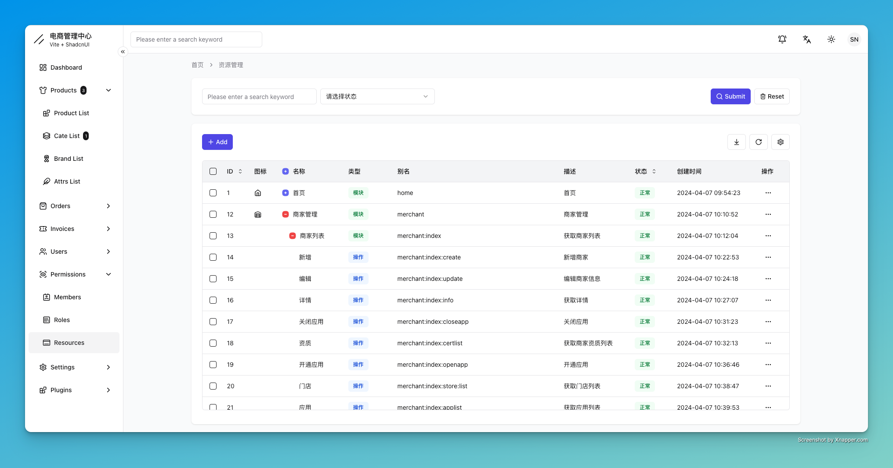

# 麻雀后台管理系统
基于React18 + Zustand + Vite + TS + RouterV6 + shadcn-UI的mqshop电商后台管理系统

# 努力开发中，敬请期待...

# 后端项目
[https://github.com/MQEnergy/mqshop](https://github.com/MQEnergy/mqshop)

# demo地址（准备中...）

# 部分截图
<p align="center" style="text-align: center">




</p>


# 运行
```shell
pnpm install
pnpm run dev
```
